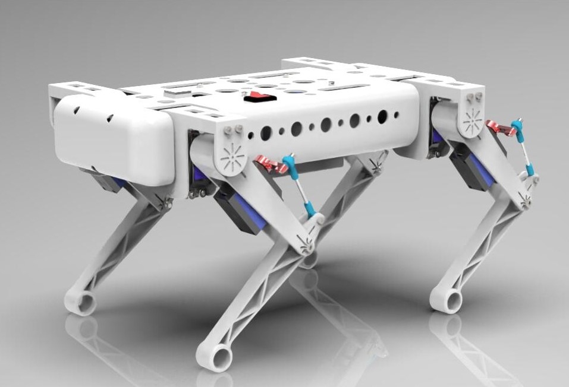
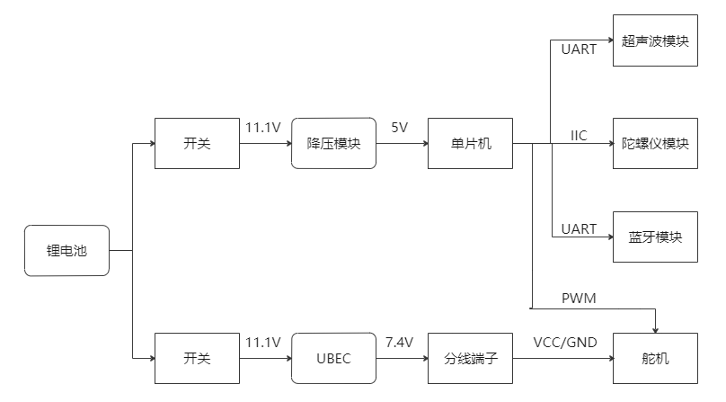
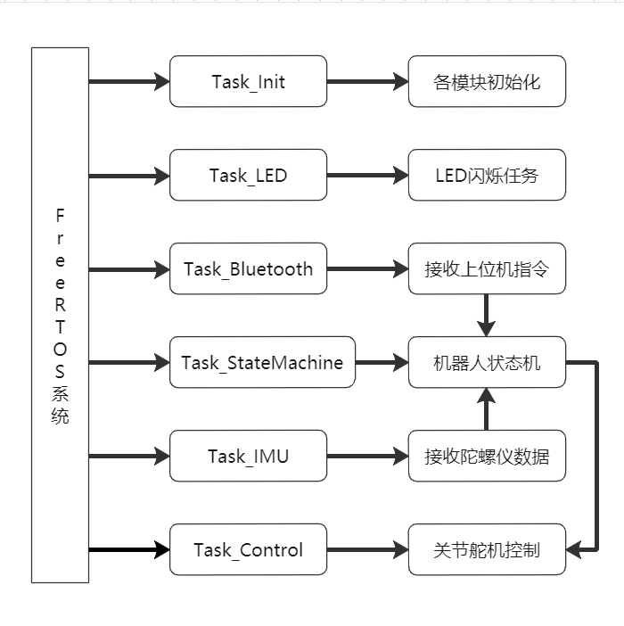
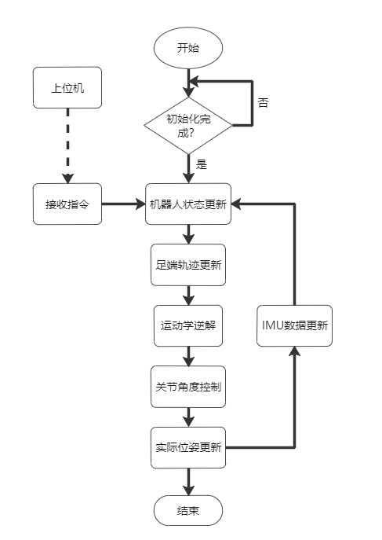

# Quadruped_robot
> 舵机驱动的12自由度四足机器人设计

## 1. 结构设计

- 机器人整体尺寸约为：400mm×230mm×180mm，重量在2kg左右
- 机器人共12自由度，各关节分别由舵机驱动；为了节省空间，小腿关节使用连杆机构间接驱动
- 为了减轻机身重量，减少加工时间，整体采用一体化设计且大面积镂空，零件均为3D打印或淘宝采购
- 设计细节可参考`三维模型`文件夹中部分内容，其中包含了两个迭代版本模型
- 所用软件：`Solidworks`，`AutoCAD`，`Keyshot`

## 2. 步态算法

- 由于舵机性能限制，本机器人的步态控制仅为开环，即采用最为常用的**逆运动学解算**实现（详细内容可参考《机器人学》一书或知乎相关解答），在步态稳定性上还有很大提升空间

## 3. 动力学仿真

- 动力学仿真基于`ADAMS`和`Matlab`，主要完成了四足机器人在平地和上下坡面的简单步态仿真
- 简述一下仿真步骤：
  - 通过`Simulink`实现运动学逆解，通过设定的足端轨迹函数求解得到各关节角随时间变化曲线
  - 提取得到数据后，导入`ADAMS`建立样条曲线，分别作为对应各关节驱动
  - 在`ADAMS`中设置接触力、摩擦力等参数，实现机器人的步态仿真
- 详细内容可参考`动力学仿真`文件夹中部分内容
- 所用软件：`ADAMS`，`Matlab`

## 4. 硬件系统设计

- STM32F103作为控制主板，搭载陀螺仪模块实现IMU自稳，蓝牙模块实现实时通讯，超声波测距模块实现简单避障
- 整个机器人通过3300mAh锂电池进行供电，分为两路：
  - 一路用于舵机供电，通过UBEC独立供电模块保证供电电压及电流的稳定
  - 一路用于单片机供电，使用了LM2596降压模块进行稳压

## 5. 软件系统设计

         

- 主要采用基于`STM32`的`FreeRTOS`操作系统实现，其任务分配及调度情况如上左图所示
- 整个机器人的控制逻辑如上右图所示
- 实现细节可参考`单片机控制代码`文件夹中部分内容
- 所用软件：`Keil`

## 6.说明

- 该项目为本科毕设项目，设计、建模、装配、调试均由本人完成；由于部分专业知识缺乏以及制作时间限制，在很多地方都存在不成熟的设计，整个项目仅供参考
- **禁止将该项目用于任何商业行为**
- 如有疑问欢迎交流讨论
