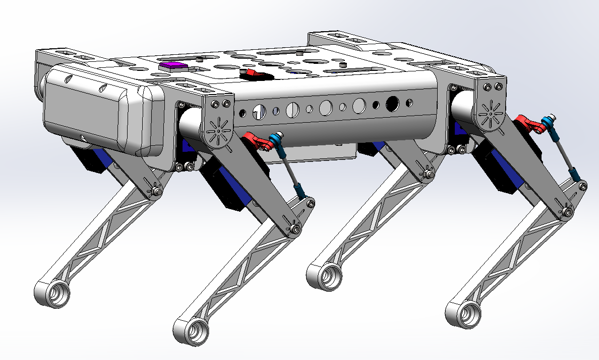
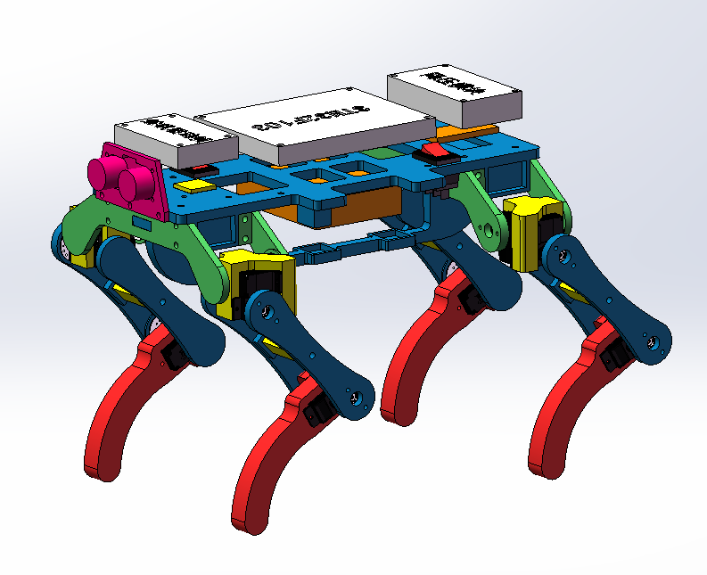
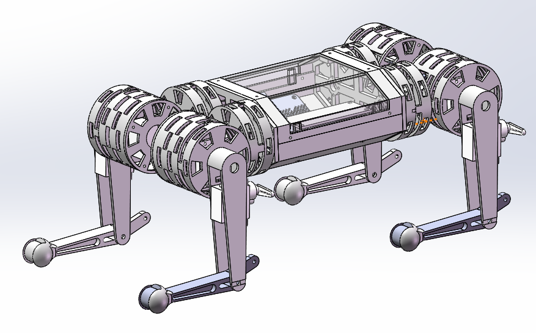

# 三维模型说明
- 本项目所使用的三维模型为SPT5425舵机版，共12个舵机，单个舵机价格约为70元，成本较高，[淘宝链接（仅供参考）](https://item.taobao.com/item.htm?spm=a1z09.2.0.0.b1d32e8dzFrjE9&id=581039145230&_u=o2pleos5e212)

  `Quadruped_Robot_Model.STEP`即为对应的STEP格式文件。

  原模型（Solidworks 2019）下载链接：https://pan.baidu.com/s/1EVniczHE6NO68WBZ6jarPw 提取码：nt8v

  

- 此外，以下为成本更低的迭代版本，但整机性能有所下降。

  - SCS0009舵机版模型，单个舵机价格约为38元，Solidworks 2019版本下载链接：https://pan.baidu.com/s/1cAEqWpKtOTWmSGVl0khZVw 提取码：w0jo

    

    

  - mg90s舵机版模型，单个舵机价格约为10元，Solidworks 2019版本下载链接：https://pan.baidu.com/s/1UsPqu-OiglWM5PlEbBo1Vw 提取码：l3h5

    